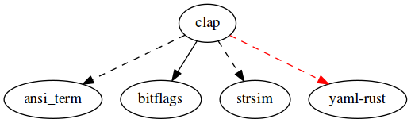

# clap

[](https://travis-ci.org/kbknapp/clap-rs) [](https://crates.io/crates/clap) [](https://github.com/kbknapp/clap-rs/blob/master/LICENSE-MIT) [](https://coveralls.io/github/kbknapp/clap-rs?branch=master) [](https://gitter.im/kbknapp/clap-rs?utm_source=badge&utm_medium=badge&utm_campaign=pr-badge&utm_content=badge)

Command Line Argument Parser for Rust

It is a simple to use, efficient, and full featured library for parsing command line arguments and subcommands when writing console, or terminal applications.

## What's New

If you're already familiar with `clap` but just want to see some new highlights as of **1.3.0**

* You can now **build a CLI from YAML** - This keeps your Rust source nice and tidy :) Full details can be found in [examples/17_yaml.rs](https://github.com/kbknapp/clap-rs/blob/master/examples/17_yaml.rs)
* A very minor "breaking" change which should affect very, very few people. If you're using `ArgGroup::*_all`, they no longer take a `Vec<&str>`, but now takes a far more versatile `&[&str]`. If you were using code such as `.add_all(vec!["arg1", "arg2"])` you only need to change the `vec!`->`&` and it should work again. This also has the added benefit of not needlessly allocating the `Vec`!
* Some other minor bug fixes and improvements

For full details see the [changelog](https://github.com/kbknapp/clap-rs/blob/master/CHANGELOG.md)

## About

`clap` is used to parse *and validate* the string of command line arguments provided by the user at runtime. You provide the list of valid possibilities, and `clap` handles the rest. This means you focus on your *applications* functionality, and less on the parsing and validating of arguments.

`clap` also provides the traditional version and help switches (or flags) 'for free' meaning automatically with no configuration. It does this by checking list of valid possibilities you supplied and if you haven't them already (or only defined some of them), `clap` will auto-generate the applicable ones. If you are using subcommands, `clap` will also auto-generate a `help` subcommand for you in addition to the traditional flags.

Once `clap` parses the user provided string of arguments, it returns the matches along with any applicable values. If the user made an error or typo, `clap` informs them of the mistake and exits gracefully. Because of this, you can make reasonable assumptions in your code about the validity of the arguments.

## Features

Below are a few of the features which `clap` supports, full descriptions and usage can be found in the [documentation](http://kbknapp.github.io/clap-rs/clap/index.html) and `examples/` directory

* **Auto-generated Help, Version, and Usage information**
  - Can optionally be fully, or partially overridden if you want a custom help, version, or usag
* **Flags / Switches** (i.e. bool fields)
  - Both short and long versions supported (i.e. `-f` and `--flag` respectively)
  - Supports combining short versions (i.e. `-fBgoZ` is the same as `-f -B -g -o -Z`)
  - Optionally supports multiple occurrences (i.e. `-vvv` or `-v -v -v`)
* **Positional Arguments** (i.e. those which are based off an index from the program name)
  - Optionally supports multiple values (i.e. `myprog <file>...` such as `myprog file1.txt file2.txt` being two values for the same "file" argument)
  - Optionally supports Specific Value Sets (See below)
  - Supports the unix `--` meaning, only positional arguments follow
  - Optionally sets value parameters (such as the minimum number of values, the maximum number of values, or the exact number of values)
* **Option Arguments** (i.e. those that take values as options)
  - Both short and long versions supported (i.e. `-o value` and `--option value` or `--option=value` respectively)
  - Optionally supports multiple values (i.e. `-o <value> -o <other_value>` or the shorthand `-o <value> <other_value>`)
  - Optionally supports Specific Value Sets (See below)
  - Optionally supports named values so that the usage/help info appears as `-o <name> <other_name>` etc. for when you require specific multiple values
  - Optionally sets value parameters (such as the minimum number of values, the maximum number of values, or the exact number of values)
* **Sub-Commands** (i.e. `git add <file>` where `add` is a sub-command of `git`)
  - Support their own sub-arguments, and sub-sub-commands independent of the parent
  - Get their own auto-generated Help, Version, and Usage independent of parent
* **Requirement Rules**: Arguments can optionally define the following types of requirement rules
  - Required by default
  - Required only if certain arguments are present
  - Can require other arguments to be present
* **Exclusion/Confliction Rules**: Arguments can optionally define the following types of exclusion rules
  - Can be disallowed when certain arguments are present
  - Can disallow use of other arguments when present
* **Groups**: Arguments can optionally be made part of a group which means one, and only one argument from this "group" may be present at runtime
  - Fully compatible with other relational rules (requirements and exclusions) which allows things like requiring the use of a group, or denying the use of a group conditionally
* **Specific Value Sets**: Positional or Option Arguments can optionally define a specific set of allowed values (i.e. imagine a `--mode` option which may *only* have one of two values `fast` or `slow` such as `--mode fast` or `--mode slow`)
* **Default Values**: Although not specifically provided by `clap` you can achieve this exact functionality from Rust's `Option<&str>.unwrap_or("some default")` method (or `Result<T,String>.unwrap_or(T)` when using typed values)
* **Automatic Version from Cargo.toml**: `clap` is fully compatible with Rust's `env!()` macro for automatically setting the version of your application to the version in your Cargo.toml. See `examples/09_AutoVersion.rs` for how to do this (Thanks to [jhelwig](https://github.com/jhelwig) for pointing this out)
* **Typed Values**: You can use several convenience macros provided by `clap` to get typed values (i.e. `i32`, `u8`, etc.) from positional or option arguments so long as the type you request implements `std::str::FromStr` See the `examples/12_TypedValues.rs`. You can also use `clap`s `simple_enum!` or `arg_enum!` macro to create an enum with variants that automatically implements `std::str::FromStr`. See `examples/13a_EnumValuesAutomatic.rs` for details and performs an ascii case insensitive parse from a `string`->`enum`.
* **Suggestions**: Suggests corrections when the user enter's a typo. For example, if you defined a `--myoption <value>` argument, and the user mistakenly typed `--moyption value` (notice `y` and `o` switched), they would receive a `Did you mean '--myoption' ?` error and exit gracefully. This also works for subcommands and flags. (Thanks to [Byron](https://github.com/Byron) for the implementation) (This feature can optionally be disabled, see 'Optional Dependencies / Features')
* **Colorized (Red) Errors (Non Windows OS only)**: Error message are printed in red text (this feature can optionally be disabled, see 'Optional Dependencies / Features').
* **Global Arguments**: Arguments can optionally be defined once, and be available to all child subcommands.
* **Custom Validations**: You can define a function to use as a validator of argument values. Imagine defining a function to validate IP addresses, or fail parsing upon error. This means your application logic can be soley focused on *using* values.
* **POSIX Compatible Conflicts** - In POSIX args can be conflicting, but not fail parsing because whichever arg comes *last* "wins" to to speak. This allows things such as aliases (i.e. `alias ls='ls -l'` but then using `ls -C` in your terminal which ends up passing `ls -l -C` as the final arguments. Since `-l` and `-C` aren't compatible, this effectively runs `ls -C` in `clap` if you choose...`clap` also supports hard conflicts that fail parsing). (Thanks to [Vinatorul](https://github.com/Vinatorul)!)
* **Support for building CLIs from YAML** - This keeps your Rust source nice and tidy!

## Quick Example

The following two examples show a quick example of some of the very basic functionality of `clap`. For more advanced usage, such as requirements, exclusions, groups, multiple values and occurrences see the [video tutorials](https://www.youtube.com/playlist?list=PLza5oFLQGTl0Bc_EU_pBNcX-rhVqDTRxv), [documentation](http://kbknapp.github.io/clap-rs/clap/index.html), or `examples/` directory of this repository.

 *NOTE:* All these examples are functionally the same, but show three different styles in which to use `clap`

```rust
// (Full example with detailed comments in examples/01a_QuickExample.rs)
//
// This example demonstrates clap's "usage strings" method of creating arguments which is less
// less verbose
extern crate clap;
use clap::{Arg, App, SubCommand};

fn main() {
    let matches = App::new("myapp")
                          .version("1.0")
                          .author("Kevin K. <kbknapp@gmail.com>")
                          .about("Does awesome things")
                          .args_from_usage(
                              "-c --config=[CONFIG] 'Sets a custom config file'
                              <INPUT> 'Sets the input file to use'
                              [debug]... -d 'Sets the level of debugging information'")
                          .subcommand(SubCommand::with_name("test")
                                      .about("controls testing features")
                                      .version("1.3")
                                      .author("Someone E. <someone_else@other.com>")
                                      .arg_from_usage("-v --verbose 'Print test information verbosely'"))
                          .get_matches();

    // Calling .unwrap() is safe here because "INPUT" is required (if "INPUT" wasn't
    // required we could have used an 'if let' to conditionally get the value)
    println!("Using input file: {}", matches.value_of("INPUT").unwrap());

    // Gets a value for config if supplied by user, or defaults to "default.conf"
    let config = matches.value_of("CONFIG").unwrap_or("default.conf");
    println!("Value for config: {}", config);

    // Vary the output based on how many times the user used the "debug" flag
    // (i.e. 'myapp -d -d -d' or 'myapp -ddd' vs 'myapp -d'
    match matches.occurrences_of("debug") {
        0 => println!("Debug mode is off"),
        1 => println!("Debug mode is kind of on"),
        2 => println!("Debug mode is on"),
        3 | _ => println!("Don't be crazy"),
    }

    // You can information about subcommands by requesting their matches by name
    // (as below), requesting just the name used, or both at the same time
    if let Some(matches) = matches.subcommand_matches("test") {
        if matches.is_present("verbose") {
            println!("Printing verbosely...");
        } else {
            println!("Printing normally...");
        }
    }

    // more porgram logic goes here...
}
```

The following example is functionally the same as the one above, but this method allows more advanced configuration options (not shown in this small example), or even dynamically generating arguments when desired. Both methods can be used together to get the best of both worlds (see the documentation, examples, or video tutorials).

```rust
// (Full example with detailed comments in examples/01b_QuickExample.rs)
//
// This example demonstrates clap's full 'builder pattern' style of creating arguments which is
// more verbose, but allows easier editting, and at times more advanced options, or the possibility
// to generate arguments dynamically.
extern crate clap;
use clap::{Arg, App, SubCommand};

fn main() {
    let matches = App::new("myapp")
                          .version("1.0")
                          .author("Kevin K. <kbknapp@gmail.com>")
                          .about("Does awesome things")
                          .arg(Arg::with_name("CONFIG")
                               .short("c")
                               .long("config")
                               .help("Sets a custom config file")
                               .takes_value(true))
                          .arg(Arg::with_name("INPUT")
                               .help("Sets the input file to use")
                               .required(true)
                               .index(1))
                          .arg(Arg::with_name("debug")
                               .short("d")
                               .multiple(true)
                               .help("Sets the level of debugging information"))
                          .subcommand(SubCommand::with_name("test")
                                      .about("controls testing features")
                                      .version("1.3")
                                      .author("Someone E. <someone_else@other.com>")
                                      .arg(Arg::with_name("verbose")
                                          .short("v")
                                          .help("print test information verbosely")))
                          .get_matches();

    // Calling .unwrap() is safe here because "INPUT" is required (if "INPUT" wasn't
    // required we could have used an 'if let' to conditionally get the value)
    println!("Using input file: {}", matches.value_of("INPUT").unwrap());

    // Gets a value for config if supplied by user, or defaults to "default.conf"
    let config = matches.value_of("CONFIG").unwrap_or("default.conf");
    println!("Value for config: {}", config);

    // Vary the output based on how many times the user used the "debug" flag
    // (i.e. 'myapp -d -d -d' or 'myapp -ddd' vs 'myapp -d'
    match matches.occurrences_of("debug") {
        0 => println!("Debug mode is off"),
        1 => println!("Debug mode is kind of on"),
        2 => println!("Debug mode is on"),
        3 | _ => println!("Don't be crazy"),
    }

    // You can information about subcommands by requesting their matches by name
    // (as below), requesting just the name used, or both at the same time
    if let Some(matches) = matches.subcommand_matches("test") {
        if matches.is_present("verbose") {
            println!("Printing verbosely...");
        } else {
            println!("Printing normally...");
        }
    }

    // more program logic goes here...
}
```

This final method shows how you can use a YAML file to build your CLI and keep your Rust source tidy. First, create the `cli.yml` file to hold your CLI options, but it could be called anything we like (we'll use the same both examples above to keep it functionally equivilant):

```yaml
name: myapp
version: 1.0
author: Kevin K. <kbknapp@gmail.com>
about: Does awesome things
args:
    - CONFIG:
        short: c
        long: config
        help: Sets a custom config file
        takes_value: true
    - INPUT:
        help: Sets the input file to use
        required: true
        index: 1
    - debug:
        short: d
        multiple: true
        help: Sets the level of debugging information
subcommands:
    - test:
        about: controls testing features
        version: 1.3
        author: Someone E. <someone_else@other.com>
        args:
            - verbose:
                short: v
                help: print test information verbosely
```

Now we create our `main.rs` file just like we would have with the previous two examples:

```rust
// (Full example with detailed comments in examples/17_yaml.rs)
//
// This example demonstrates clap's building from YAML style of creating arguments which is far
// more clean, but takes a very small performance hit compared to the other two methods.
#[macro_use]
extern crate clap;
use clap::App;

fn main() {
    // The YAML file is found relative to the current file, similar to how modules are found
    let yaml = load_yaml!("cli.yml");
    let matches = App::from_yaml(yaml).get_mathes();

    // Calling .unwrap() is safe here because "INPUT" is required (if "INPUT" wasn't
    // required we could have used an 'if let' to conditionally get the value)
    println!("Using input file: {}", matches.value_of("INPUT").unwrap());

    // Gets a value for config if supplied by user, or defaults to "default.conf"
    let config = matches.value_of("CONFIG").unwrap_or("default.conf");
    println!("Value for config: {}", config);

    // Vary the output based on how many times the user used the "debug" flag
    // (i.e. 'myapp -d -d -d' or 'myapp -ddd' vs 'myapp -d'
    match matches.occurrences_of("debug") {
        0 => println!("Debug mode is off"),
        1 => println!("Debug mode is kind of on"),
        2 => println!("Debug mode is on"),
        3 | _ => println!("Don't be crazy"),
    }

    // You can information about subcommands by requesting their matches by name
    // (as below), requesting just the name used, or both at the same time
    if let Some(matches) = matches.subcommand_matches("test") {
        if matches.is_present("verbose") {
            println!("Printing verbosely...");
        } else {
            println!("Printing normally...");
        }
    }

    // more program logic goes here...
}
```

If you were to compile any of the above programs and run them with the flag `--help` or `-h` (or `help` subcommand, since we defined `test` as a subcommand) the following would be output

**NOTE**: The YAML option requires adding a special `features` flag when compiling `clap` because it is not compiled by default since it takes additional dependencies that some people may not need. Simply change your `clap = "*"` to `clap = {version = "*", features = ["yaml"]}` in your `Cargo.toml` to use the YAML version.

```sh
$ myapp --help
myapp 1.0
Kevin K. <kbknapp@gmail.com>
Does awesome things

USAGE:
    MyApp [FLAGS] [OPTIONS] <INPUT> [SUBCOMMAND]

FLAGS:
    -d               Turn debugging information on
    -h, --help       Prints this message
    -V, --version    Prints version information

OPTIONS:
    -c, --config <CONFIG>    Sets a custom config file

ARGS:
    INPUT    The input file to use

SUBCOMMANDS:
    help    Prints this message
    test    Controls testing features
```

*NOTE:* You could also run `myapp test --help` to see similar output and options for the `test` subcommand.

## Try it!

### Pre-Built Test

To try out the pre-built example use the following stes:

* Clone the repostiory `$ git clone https://github.com/kbknapp/clap-rs && cd clap-rs/clap-tests`
* Compile the example `$ cargo build --release`
* Run the help info `$ ./target/release/claptests --help`
* Play with the arguments!

### BYOB (Build Your Own Binary)

To test out `clap`'s default auto-generated help/version follow these steps:
* Create a new cargo project `$ cargo new fake --bin && cd fake`
* Add `clap` to your `Cargo.toml`
*
```toml
[dependencies]
clap = "*"
```

* Add the following to your `src/main.rs`

```rust
extern crate clap;
use clap::App;

fn main() {
  let _ = App::new("fake").version("v1.0-beta").get_matches();
}
```

* Build your program `$ cargo build --release`
* Run with help or version `$ ./target/release/fake --help` or `$ ./target/release/fake --version`

## Usage

For full usage, add `clap` as a dependecy in your `Cargo.toml` file to use from crates.io:

 ```toml
 [dependencies]
 clap = "*"
 ```
 Or track the latest on the master branch at github:

```toml
[dependencies.clap]
git = "https://github.com/kbknapp/clap-rs.git"
```

Add `extern crate clap;` to your crate root.

Define a list of valid arguments for your program (see the [documentation](https://kbknapp.github.io/clap-rs/index.html) or `examples/` directory of this repo)

Then run `cargo build` or `cargo update && cargo build` for your project.

### Optional Dependencies / Features

If you'd like to keep your dependency list to **only** `clap`, you can disable any features that require an additional dependency. To do this, add this to your `Cargo.toml`:

```toml
[dependencies.clap]
version = "*"
default-features = false
```

You can also selectively enable only the features you'd like to include, by adding:

```toml
[dependencies.clap]
version = "*"
default-features = false

# Cherry-pick the features you'd like to use
features = [ "suggestions", "color" ]
```

The following is a list of optional `clap` features:

* **"suggestions"**: Turns on the `Did you mean '--myoption' ?` feature for when users make typos.
* **"color"**: Turns on red error messages. This feature only works on non-Windows OSs.
* **"lints"**: This is **not** included by default and should only be used while developing to run basic lints against changes. This can only be used on Rust nightly.

### Dependencies Tree

The following graphic depicts `clap`s dependency graph.

 * **Dashed** Line: Optional dependency
 * **Red** Color: **NOT** included by default (must use cargo `features` to enable)



### More Information

You can find complete documentation on the [github-pages site](http://kbknapp.github.io/clap-rs/clap/index.html) for this project.

You can also find usage examples in the `examples/` directory of this repo.

#### Video Tutorials

There's also the video tutorial series [Argument Parsing with Rust](https://www.youtube.com/playlist?list=PLza5oFLQGTl0Bc_EU_pBNcX-rhVqDTRxv) that I've been working on.

*Note*: Two new videos have just been added ([08 From Usage](https://youtu.be/xc6VdedFrG0), and [09 Typed Values](https://youtu.be/mZn3C1DnD90)), if you're already familiar with `clap` but want to know more about these two details you can check out those videos without watching the previous few.

*Note*: Apologies for the resolution of the first video, it will be updated to a better resolution soon. The other videos have a proper resolution.

## [How to Contribute](https://github.com/kbknapp/clap-rs/blob/master/CONTRIBUTING.md)

Contributions are always welcome! And there is a multitude of ways in which you can help depending on what you like to do, or are good at. Anything from documentation, code cleanup, issue completion, new features, you name it, even filing issues is contributing and greatly appreciated!

1. Fork `clap`
2. Clone your fork (`git clone https://github.com/$YOUR_USERNAME/clap-rs && cd clap-rs`)
3. Create new branch (`git checkout -b new-branch`)
4. Make your changes, and commit (`git commit -am "your message"`)
 * I use a [conventional](https://github.com/ajoslin/conventional-changelog/blob/a5505865ff3dd710cf757f50530e73ef0ca641da/conventions/angular.md) changelog format so I can update my changelog using [clog](https://github.com/thoughtram/clog)
 * In addition to the conventions defined above, I also use `imp`, `wip`, `examples`.
 * Format your commit subject line using the following format: `TYPE(COMPONENT): MESSAGE` where `TYPE` is one of the following:
    - `feat` - A new feature
    - `imp` - An improvement to an existing feature
    - `perf` - A performance improvement
    - `docs` - Changes to documentation only
    - `tests` - Changes to the testing framework or tests only
    - `fix` - A bug fix
    - `refactor` - Code functionality doesn't change, but underlying structure may
    - `style` - Stylistic changes only, no functionality changes
    - `wip` - A work in progress commit (Should typically be `git rebase`'ed away)
    - `chore` - Catch all or things that have to do with the build system, etc
    - `examples` - Changes to existing example, or a new example
 * The `COMPONENT` is optional, and may be a single file, directory, or logical component. Can be omitted if commit applies globally
5. Run the tests (`cargo test --features yaml && make -C clap-tests test`)
6. `git rebase` into concise commits and remove `--fixup`s (`git rebase -i HEAD~NUM` where `NUM` is number of commits back)
7. Push your changes back to your fork (`git push origin $your-branch`)
8. Create a pull request! (You can also create the pull request first, and we'll merge when ready. This a good way to discuss proposed changes.)

Another really great way to help is if you find an interesting, or helpful way in which to use `clap`. You can either add it to the `examples/` directory, or file an issue and tell me. I'm all about giving credit where credit is due :)

### Running the tests

If contributing, you can run the tests as follows (assuming you're in the `clap-rs` directory)

```
cargo test --features yaml && make -C clap-tests test
```

### Goals

There are a few goals of `clap` that I'd like to maintain throughout contributions. If your proposed changes break, or go against any of these goals we'll discuss the changes further before merging (but will *not* be ignored, all contributes are welcome!). These are by no means hard-and-fast rules, as I'm no expert and break them myself from time to time (even if by mistake or ignorance :P).

* Remain backwards compatible when possible
  - If backwards compatibility *must* be broken, use deprecation warnings if at all possible before removing legacy code
  - This does not apply for security concerns
* Parse arguments quickly
  - Parsing of arguments shouldn't slow down usage of the main program
  - This is also true of generating help and usage information (although *slightly* less stringent, as the program is about to exit)
* Try to be cognizant of memory usage
  - Once parsing is complete, the memory footprint of `clap` should be low since the  main program is the star of the show
* `panic!` on *developer* error, exit gracefully on *end-user* error

## License

`clap` is licensed under the MIT license. Please read the LICENSE-MIT file in this repository for more information.

## Recent Breaking Changes

Although I do my best to keep breaking changes to a minimum, being that this a sub 1.0 library, there are breaking changes from time to time in order to support better features or implementation. For the full details see the changelog.md

* As of 0.11.0: The default short flag for `version` has changed from `-v` to `-V` (Uppercase). Although you can also now override the short flag for `help` and `version` using `App::help_short()` and `App::version_short()`
* As of 0.7.0
  - `Arg::possible_values()`, `Arg::value_names()`, `Arg::requires_all()`, `Arg::mutually_excludes_all()` [deprecated], `Arg::conflicts_with_all()`
    + No longer take a `Vec<&str>`, instead they take a generic `IntoIterator<Item=AsRef<str>>` which means you cannot use an inline `vec![]` but it means the methods are now far more flexible, especially for dynamic value generation.
    + Instead use something that conforms to the `IntoIterator` trait, or something like:

    ```rust
    let my_vals = ["value1", "value2", "value3"];
    ...
    .possible_values(&my_vals)
    ```

### Deprecations

Old method names will be left around for some time.

* As of 1.3.0
 - `ArgGroup::add_all` now takes `&[&str]` instead of a `Vec<&str>`
 - `ArgGroup::requires_all` now takes `&[&str]` instead of a `Vec<&str>`
 - `ArgGroup::conflicts_with_all` now takes `&[&str]` instead of a `Vec<&str>`
* As of 1.2.0 (Will **not** be removed until 2.x)
 - `App::subcommands_negate_reqs(bool)` -> `AppSettings::SubcommandsNegateReqs` passed to `App::setting()`
 - `App::subcommand_required(bool)` -> `AppSettings::SubcommandRequired` passed to `App::setting()`
 - `App::arg_required_else_help(bool)` -> `AppSettings::ArgRequiredElseHelp` passed to `App::setting()`
 - `App::global_version(bool)` -> `AppSettings::GlobalVersion` passed to `App::setting()`
 - `App::versionless_subcommands(bool)` -> `AppSettings::VersionlessSubcommands` passed to `App::setting()`
 - `App::unified_help_messages(bool)` -> `AppSettings::UnifiedHelpMessages` passed to `App::setting()`
 - `App::wait_on_error(bool)` -> `AppSettings::WaitOnError` passed to `App::setting()`
 - `App::subcommand_required_else_help(bool)` -> `AppSettings::SubcommandRequiredElseHelp` passed to `App::setting()`

* As of 0.10.0
 - `SubCommand::new()` -> `SubCommand::with_name()` (Removed as of 1.0.0)
 - `App::error_on_no_subcommand()` -> `App::subcommand_required()` (Removed as of 1.0.0)
* As of 0.6.8
 - `Arg::new()` -> `Arg::with_name()` (Removed as of 1.0.0)
 - `Arg::mutually_excludes()` -> `Arg::conflicts_with()` (Removed as of 1.0.0)
 - `Arg::mutually_excludes_all()` -> `Arg::conflicts_with_all()` (Removed as of 1.0.0)
