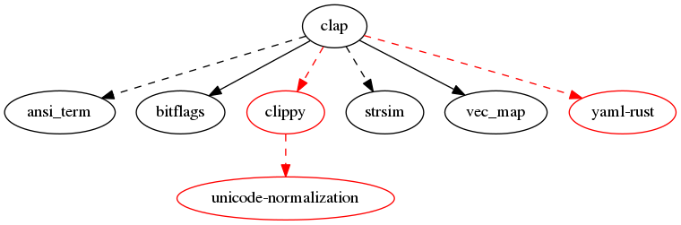

clap
====

[](https://crates.io/crates/clap) [](https://crates.io/crates/clap) [](https://github.com/kbknapp/clap-rs/blob/master/LICENSE-MIT) [](https://coveralls.io/github/kbknapp/clap-rs?branch=master) [](https://gitter.im/kbknapp/clap-rs?utm_source=badge&utm_medium=badge&utm_campaign=pr-badge&utm_content=badge)

Linux: [](https://travis-ci.org/kbknapp/clap-rs)
Windows: [](https://ci.appveyor.com/project/kbknapp/clap-rs/branch/master)

Command Line Argument Parser for Rust

It is a simple-to-use, efficient, and full-featured library for parsing command line arguments and subcommands when writing console/terminal applications.

## [documentation](https://docs.rs/clap/)
## [website](https://clap.rs/)
## [blog](https://blog.clap.rs/)

Table of Contents
=================

* [What's New](#whats-new)
* [About](#about)
* [FAQ](#faq)
* [Features](#features)
* [Quick Example](#quick-example)
* [Try it!](#try-it)
  * [Pre-Built Test](#pre-built-test)
  * [BYOB (Build Your Own Binary)](#byob-build-your-own-binary)
* [Usage](#usage)
  * [Optional Dependencies / Features](#optional-dependencies--features)
  * [Dependencies Tree](#dependencies-tree)
  * [More Information](#more-information)
    * [Video Tutorials](#video-tutorials)
* [How to Contribute](#how-to-contribute)
  * [Testing Code](#testing-code)
  * [Linting Code](#linting-code)
  * [Debugging Code](#debugging-code)
  * [Goals](#goals)
  * [Compatibility Policy](#compatibility-policy)
    * [Minimum Version of Rust](#minimum-version-of-rust)
* [License](#license)
* [Recent Breaking Changes](#recent-breaking-changes)
  * [Deprecations](#deprecations)

Created by [gh-md-toc](https://github.com/ekalinin/github-markdown-toc)

## What's New

Here's the highlights for v2.20.5

* Fixes a critical bug in the `clap_app!` macro of a missing fragment specifier when using `!property` style tags.


Here's the highlights from v2.0.0 to v2.20.4

* Fixes a bug that tried to propogate global args multiple times when generating multiple completion scripts
* Fix examples link in CONTRIBUTING.md
* **Completions**: fixes bash completions for commands that have an underscore in the name
* **Completions**: fixes a bug where ZSH completions would panic if the binary name had an underscore in it
* allow final word to be wrapped in wrap_help
* **Completions**: fixes a bug where global args weren't included in the generated completion scripts
* **Macros Documentation:**  adds a warning about changing values in Cargo.toml not triggering a rebuild automatically
* Fixes a critical bug where subcommand settings were being propogated too far
* Adds ArgGroup::multiple to the supported YAML fields for building ArgGroups from YAML
* Fixes a bug where the final word wasn't wrapped in help messages
* Fixes finding required arguments in group arguments
* **ArgsNegateSubcommands:**  disables args being allowed between subcommands
* **DontCollapseArgsInUsage:** disables the collapsing of positional args into `[ARGS]` in the usage string
* **DisableHelpSubcommand:**  disables building the `help` subcommand
* **AllowMissingPositional:**  allows one to implement `$ prog [optional] <required>` style CLIs where the second postional argument is required, but the first is optional
* **PropagateGlobalValuesDown:**  automatically propagats global arg's values down through *used* subcommands
* **Arg::value_terminator:**  adds the ability to terminate multiple values with a given string or char
* **Arg::default_value_if[s]:**  adds new methods for *conditional* default values (such as a particular value from another argument was used)
* **Arg::requires_if[s]:**  adds the ability to *conditionally* require additional args (such as if a particular value was used)
* **Arg::required_if[s]:**  adds the ability for an arg to be *conditionally* required (i.e. "arg X is only required if arg Y was used with value Z")
* **Arg::validator_os:**  adds ability to validate values which may contain invalid UTF-8
* **crate_description!:** Uses the `Cargo.toml` description field to fill in the `App::about` method at compile time
* **crate_name!:** Uses the `Cargo.toml` name field to fill in the `App::new` method at compile time
* **app_from_crate!:** Combines `crate_version!`, `crate_name!`, `crate_description!`, and `crate_authors!` into a single macro call to build a default `App` instance from the `Cargo.toml` fields
* **no_cargo:**  adds a `no_cargo` feature to disable Cargo-env-var-dependent macros for those *not* using `cargo` to build their crates
* **Options:**  fixes a critical bug where options weren't forced to have a value
*   fixes a bug where calling the help of a subcommand wasn't ignoring required args of parent commands
* **Help Subcommand:**  fixes a bug where the help subcommand couldn't be overriden
* **Low Index Multiples:**  fixes a bug which caused combinations of LowIndexMultiples and `Arg::allow_hyphen_values` to fail parsing
* **Default Values:**  improves the error message when default values are involved
* **YAML:**  adds conditional requirements and conditional default values to YAML
*  Support `--("some-arg-name")` syntax for defining long arg names when using `clap_app!` macro
*  Support `("some app name")` syntax for defining app names when using `clap_app!` macro
* **Help Wrapping:**  long app names (with spaces), authors, and descriptions are now wrapped appropriately
* **Conditional Default Values:**  fixes the failing doc tests of Arg::default_value_ifs
* **Conditional Requirements:**  adds docs for Arg::requires_ifs
* Fixes a bug where calling the help of a subcommand wasn't ignoring required args of parent commands
* Fixes a bug by escaping square brackets in ZSH completions which were causing conflicts and errors.
* **Bash Completion:**  allows bash completion to fall back to traidtional bash completion upon no matching completing function
* **Arg Setting**: Allows specifying an `AllowLeadingHyphen` style setting for values only for specific args, vice command wide
* **Validators:**  improves the error messages for validators
* **Required Unless:**  fixes a bug where having required_unless set doesn't work when conflicts are also set
* **ZSH Completions:**  fixes an issue where zsh completions caused panics if there were no subcommands
* **Completions:**  Adds completion support for Microsoft PowerShell! (Thanks to @Arnavion)
* Allows specifying the second to last positional argument as `multiple(true)` (i.e. things such as `mv <files>... <target>`)
* Adds an `App::get_name` and `App::get_bin_name`
* Conflicting argument errors are now symetrical, meaning more consistent and better usage suggestions
* **Completions:**  adds automatic ZSH completion script generation support! :tada: :tada:
* **AppSettings:**  adds new setting `AppSettings::AllowNegativeNumbers` which functions like `AllowLeadingHyphen` except only allows undefined negative numbers to pass parsing.
* Stabilize `clap_app!` macro (i.e. no longer need to use `unstable` feature)
* Deprecate `App::with_defaults`
* One can now alias arguments either visibly (which appears in the help text) or invisibly just like subcommands!
* The `from_usage` parser now correctly handles non-ascii names / options and help!
* **Value Delimiters:**  fixes the confusion around implicitly setting value delimiters. (The default is to *not* use a delimiter unless explicitly set)
* Changes the default value delimiter rules (i.e. the default is `use_delimiter(false)` *unless* a setting/method that implies multiple values was used) **[Bugfix that *may* "break" code]**
 * If code breaks, simply add `Arg::use_delimiter(true)` to the affected args
* Adds ability to hide the possible values from the help text on a per argument basis, instead of command wide
* Allows for limiting detected terminal width (i.e. wrap at `x` length, unless the terminal width is *smaller*)
* `clap` now ignores hard newlines in help messages and properly re-aligns text, but still wraps if the term width is too small
* Adds support for the setting `Arg::require_delimiter` from YAML
* `clap` no longer requires one to use `{n}` inside help text to insert a newline that is properly aligned. One can now use the normal `\n`.
* `clap` now ignores hard newlines in help messages and properly re-aligns text, but still wraps if the term width is too small
* Errors can now have custom description
* Uses `term_size` instead of home-grown solution on Windows
* Adds the ability to wrap help text intelligently on Windows!
* Moves docs to [docs.rs!](https://docs.rs/clap/)!
* Automatically moves help text to the next line and wraps when term width is determined to be too small, or help text is too long
* Vastly improves *development* error messages when using YAML
* Adds a shorthand way to ignore help text wrapping and use source formatting (i.e. `App::set_term_width(0)`)
* **Help Subcommand:**  fixes misleading usage string when using multi-level subcommmands such as `myprog help subcmd1 subcmd2`
* **YAML:**  allows using lists or single values with certain arg declarations for increased ergonomics
* **Fish Shell Completions:**  one can generate a basic fish completions script at compile time!
* Adds the ability to generate completions to an `io::Write` object
* Adds an `App::unset_setting` and `App::unset_settings`
* **Completions:**  one can now [generate a bash completions](https://docs.rs/clap/2.9.0/clap/struct.App.html#method.gen_completions) script at compile time! These completions work with options using [possible values](https://docs.rs/clap/2.9.0/clap/struct.Arg.html#method.possible_values), [subcommand aliases](https://docs.rs/clap/2.9.0/clap/struct.App.html#method.aliases), and even multiple levels of subcommands
* **Arg:**  adds new optional setting [`Arg::require_delimiter`](https://docs.rs/clap/2.8.0/clap/struct.Arg.html#method.require_delimiter) which requires val delimiter to parse multiple values
* The terminal sizing portion has been factored out into a separate crate, [term_size](https://crates.io/crates/term_size)
* Options using multiple values and delimiters no longer parse additional values after a trailing space (i.e. `prog -o 1,2 file.txt` parses as `1,2` for `-o` and `file.txt` for a positional arg)
* Using options using multiple values and with an `=` no longer parse args after the trailing space as values (i.e. `prog -o=1 file.txt` parses as `1` for `-o` and `file.txt` for a positional arg)
* **Usage Strings:**  `[FLAGS]` and `[ARGS]` are no longer blindly added to usage strings, instead only when applicable
* `arg_enum!`:  allows using more than one meta item, or things like `#[repr(C)]` with `arg_enum!`s
* `App::print_help`: now prints the same as would have been printed by `--help` or the like
* Prevents invoking `<cmd> help help` and displaying incorrect help message
* Subcommand help messages requested via `<cmd> help <sub>` now correctly match `<cmd> <sub> --help`
* One can now specify groups which require AT LEAST one of the args
* Allows adding multiple ArgGroups per Arg
* **Global Settings:** One can now set an `AppSetting` which is propogated down through child subcommands
* **Terminal Wrapping:**  Allows wrapping at specified term width (Even on Windows!) (can now set an absolute width to "smart" wrap at)
* **SubCommands/Aliases:**  adds support for visible aliases for subcommands (i.e. aliases that are dipslayed in the help message)
* **Subcommands/Aliases:**  when viewing the help of an alias, it now display help of the aliased subcommand
* Adds new setting to stop delimiting values with `--` or `AppSettings::TrailingVarArg`
* Subcommands now support aliases - think of them as hidden subcommands that dispatch to said subcommand automatically
* Fixed times when `ArgGroup`s are duplicated in usage strings
* **Before Help:**  adds support for displaying info before help message
* **Required Unless:**  adds support for allowing args that are required unless certain other args are present
* **New Help Template Engine!**: Now you have full control over the layout of your help message. Major thanks to @hgrecco
* **Pull crate Authors from Cargo.toml**: One can now use the `crate_authors!` macro to automatically pull the crate authors from their Cargo.toml file
* **Colored Help Messages**: Help messages can now be optionally colored (See the `AppSettings::ColoredHelp` setting). Screenshot below.
* **Help text auto wraps and aligns at for subcommands too!** - Long help strings of subcommands will now properly wrap and align to term width on Linux and OS X. This can be turned off as well.
* **Help text auto wraps and aligns at term width!** - Long help strings will now properly wrap and align to term width on Linux and OS X (and presumably Unix too). This can be turned off as well.
* **Can customize the order of opts, flags, and subcommands in help messages**  - Instead of using the default alphabetical order, you can now re-arrange the order of your args and subcommands in help message. This helps to emphasize more popular or important options.
* **Can auto-derive the order from declaration order** - Have a bunch of args or subcommmands to re-order? You can now just derive the order from the declaration order!
* **Help subcommand now accepts other subcommands as arguments!** - Similar to other CLI precedents, the `help` subcommand can now accept other subcommands as arguments to display their help message. i.e. `$ myprog help mysubcmd` (*Note* these can even be nested heavily such as `$ myprog help subcmd1 subcmd2 subcmd3` etc.)
* **Default Values**: Args can now specify default values
* **Next Line Help**: Args can have help strings on the line following the argument (useful for long arguments, or those with many values). This can be set command-wide or for individual args

Here's a gif of them in action!


An example of the help text wrapping at term width:


An example of the optional colored help:


For full details, see [CHANGELOG.md](https://github.com/kbknapp/clap-rs/blob/master/CHANGELOG.md)

## About

`clap` is used to parse *and validate* the string of command line arguments provided by the user at runtime. You provide the list of valid possibilities, and `clap` handles the rest. This means you focus on your *applications* functionality, and less on the parsing and validating of arguments.

`clap` also provides the traditional version and help switches (or flags) 'for free' meaning automatically with no configuration. It does this by checking list of valid possibilities you supplied and adding only the ones you haven't already defined. If you are using subcommands, `clap` will also auto-generate a `help` subcommand for you in addition to the traditional flags.

Once `clap` parses the user provided string of arguments, it returns the matches along with any applicable values. If the user made an error or typo, `clap` informs them of the mistake and exits gracefully (or returns a `Result` type and allows you to perform any clean up prior to exit). Because of this, you can make reasonable assumptions in your code about the validity of the arguments.

## FAQ

For a full FAQ and more in depth details, see [the wiki page](https://github.com/kbknapp/clap-rs/wiki/FAQ)

### Comparisons

First, let me say that these comparisons are highly subjective, and not meant in a critical or harsh manner. All the argument parsing libraries out there (to include `clap`) have their own strengths and weaknesses. Sometimes it just comes down to personal taste when all other factors are equal. When in doubt, try them all and pick one that you enjoy :) There's plenty of room in the Rust community for multiple implementations!

#### How does `clap` compare to [getopts](https://github.com/rust-lang-nursery/getopts)?

`getopts` is a very basic, fairly minimalist argument parsing library. This isn't a bad thing, sometimes you don't need tons of features, you just want to parse some simple arguments, and have some help text generated for you based on valid arguments you specify. The downside to this approach is that you must manually implement most of the common features (such as checking to display help messages, usage strings, etc.). If you want a highly custom argument parser, and don't mind writing the majority of the functionality yourself, `getopts` is an excellent base.

`getopts` also doesn't allocate much, or at all. This gives it a very small performance boost. Although, as you start implementing additional features, that boost quickly disappears.

Personally, I find many, many uses of `getopts` are manually implementing features that `clap` provides by default. Using `clap` simplifies your codebase allowing you to focus on your application, and not argument parsing.

#### How does `clap` compare to [docopt.rs](https://github.com/docopt/docopt.rs)?

I first want to say I'm a big a fan of BurntSushi's work, the creator of `Docopt.rs`. I aspire to produce the quality of libraries that this man does! When it comes to comparing these two libraries they are very different. `docopt` tasks you with writing a help message, and then it parsers that message for you to determine all valid arguments and their use. Some people LOVE this approach, others do not. If you're willing to write a detailed help message, it's nice that you can stick that in your program and have `docopt` do the rest. On the downside, it's far less flexible.

`docopt` is also excellent at translating arguments into Rust types automatically. There is even a syntax extension which will do all this for you, if you're willing to use a nightly compiler (use of a stable compiler requires you to somewhat manually translate from arguments to Rust types). To use BurntSushi's words, `docopt` is also a sort of black box. You get what you get, and it's hard to tweak implementation or customize the experience for your use case.

Because `docopt` is doing a ton of work to parse your help messages and determine what you were trying to communicate as valid arguments, it's also one of the more heavy weight parsers performance-wise. For most applications this isn't a concern and this isn't to say `docopt` is slow, in fact from it. This is just something to keep in mind while comparing.

#### All else being equal, what are some reasons to use `clap`?

`clap` is as fast, and as lightweight as possible while still giving all the features you'd expect from a modern argument parser. In fact, for the amount and type of features `clap` offers it remains about as fast as `getopts`. If you use `clap` when just need some simple arguments parsed, you'll find it's a walk in the park. `clap` also makes it possible to represent extremely complex, and advanced requirements, without too much thought. `clap` aims to be intuitive, easy to use, and fully capable for wide variety use cases and needs.

## Features

Below are a few of the features which `clap` supports, full descriptions and usage can be found in the [documentation](https://docs.rs/clap/) and [examples/](examples) directory

* **Auto-generated Help, Version, and Usage information**
  - Can optionally be fully, or partially overridden if you want a custom help, version, or usage
* **Auto-generated bash completion scripts at compile time**
  - Even works through many multiple levels of subcommands
  - Works with options which only accept certain values
  - Works with subcommand aliases
* **Flags / Switches** (i.e. bool fields)
  - Both short and long versions supported (i.e. `-f` and `--flag` respectively)
  - Supports combining short versions (i.e. `-fBgoZ` is the same as `-f -B -g -o -Z`)
  - Supports multiple occurrences (i.e. `-vvv` or `-v -v -v`)
* **Positional Arguments** (i.e. those which are based off an index from the program name)
  - Supports multiple values (i.e. `myprog <file>...` such as `myprog file1.txt file2.txt` being two values for the same "file" argument)
  - Supports Specific Value Sets (See below)
  - Can set value parameters (such as the minimum number of values, the maximum number of values, or the exact number of values)
  - Can set custom validations on values to extend the argument parsing capability to truly custom domains
* **Option Arguments** (i.e. those that take values)
  - Both short and long versions supported (i.e. `-o value`, `-ovalue`, `-o=value` and `--option value` or `--option=value` respectively)
  - Supports multiple values (i.e. `-o <val1> -o <val2>` or `-o <val1> <val2>`)
  - Supports delimited values (i.e. `-o=val1,val2,val3`, can also change the delimiter)
  - Supports Specific Value Sets (See below)
  - Supports named values so that the usage/help info appears as `-o <FILE> <INTERFACE>` etc. for when you require specific multiple values
  - Can set value parameters (such as the minimum number of values, the maximum number of values, or the exact number of values)
  - Can set custom validations on values to extend the argument parsing capability to truly custom domains
* **Sub-Commands** (i.e. `git add <file>` where `add` is a sub-command of `git`)
  - Support their own sub-arguments, and sub-sub-commands independent of the parent
  - Get their own auto-generated Help, Version, and Usage independent of parent
* **Support for building CLIs from YAML** - This keeps your Rust source nice and tidy and makes supporting localized translation very simple!
* **Requirement Rules**: Arguments can define the following types of requirement rules
  - Can be required by default
  - Can be required only if certain arguments are present
  - Can require other arguments to be present
* **Confliction Rules**: Arguments can optionally define the following types of exclusion rules
  - Can be disallowed when certain arguments are present
  - Can disallow use of other arguments when present
* **Groups**: Arguments can be made part of a group
  - Fully compatible with other relational rules (requirements, conflicts, and overrides) which allows things like requiring the use of any arg in a group, or denying the use of an entire group conditionally
* **Specific Value Sets**: Positional or Option Arguments can define a specific set of allowed values (i.e. imagine a `--mode` option which may *only* have one of two values `fast` or `slow` such as `--mode fast` or `--mode slow`)
* **Default Values**
* **Automatic Version from Cargo.toml**: `clap` is fully compatible with Rust's `env!()` macro for automatically setting the version of your application to the version in your Cargo.toml. See [09_auto_version example](examples/09_auto_version.rs) for how to do this (Thanks to [jhelwig](https://github.com/jhelwig) for pointing this out)
* **Typed Values**: You can use several convenience macros provided by `clap` to get typed values (i.e. `i32`, `u8`, etc.) from positional or option arguments so long as the type you request implements `std::str::FromStr` See the [12_typed_values example](examples/12_typed_values.rs). You can also use `clap`s `arg_enum!` macro to create an enum with variants that automatically implement `std::str::FromStr`. See [13a_enum_values_automatic example](examples/13a_enum_values_automatic.rs) for details
* **Suggestions**: Suggests corrections when the user enters a typo. For example, if you defined a `--myoption` argument, and the user mistakenly typed `--moyption` (notice `y` and `o` transposed), they would receive a `Did you mean '--myoption'?` error and exit gracefully. This also works for subcommands and flags. (Thanks to [Byron](https://github.com/Byron) for the implementation) (This feature can optionally be disabled, see 'Optional Dependencies / Features')
* **Colorized Errors (Non Windows OS only)**: Error message are printed in in colored text (this feature can optionally be disabled, see 'Optional Dependencies / Features').
* **Global Arguments**: Arguments can optionally be defined once, and be available to all child subcommands.
* **Custom Validations**: You can define a function to use as a validator of argument values. Imagine defining a function to validate IP addresses, or fail parsing upon error. This means your application logic can be solely focused on *using* values.
* **POSIX Compatible Conflicts/Overrides** - In POSIX args can be conflicting, but not fail parsing because whichever arg comes *last* "wins" so to speak. This allows things such as aliases (i.e. `alias ls='ls -l'` but then using `ls -C` in your terminal which ends up passing `ls -l -C` as the final arguments. Since `-l` and `-C` aren't compatible, this effectively runs `ls -C` in `clap` if you choose...`clap` also supports hard conflicts that fail parsing). (Thanks to [Vinatorul](https://github.com/Vinatorul)!)
* Supports the Unix `--` meaning, only positional arguments follow

## Quick Example

The following examples show a quick example of some of the very basic functionality of `clap`. For more advanced usage, such as requirements, conflicts, groups, multiple values and occurrences see the [documentation](https://docs.rs/clap/), [examples/](examples) directory of this repository or the [video tutorials](https://www.youtube.com/playlist?list=PLza5oFLQGTl2Z5T8g1pRkIynR3E0_pc7U).

 **NOTE:** All of these examples are functionally the same, but show different styles in which to use `clap`

The first example shows a method that allows more advanced configuration options (not shown in this small example), or even dynamically generating arguments when desired. The downside is it's more verbose.

```rust
// (Full example with detailed comments in examples/01b_quick_example.rs)
//
// This example demonstrates clap's full 'builder pattern' style of creating arguments which is
// more verbose, but allows easier editing, and at times more advanced options, or the possibility
// to generate arguments dynamically.
extern crate clap;
use clap::{Arg, App, SubCommand};

fn main() {
    let matches = App::new("My Super Program")
                          .version("1.0")
                          .author("Kevin K. <kbknapp@gmail.com>")
                          .about("Does awesome things")
                          .arg(Arg::with_name("config")
                               .short("c")
                               .long("config")
                               .value_name("FILE")
                               .help("Sets a custom config file")
                               .takes_value(true))
                          .arg(Arg::with_name("INPUT")
                               .help("Sets the input file to use")
                               .required(true)
                               .index(1))
                          .arg(Arg::with_name("v")
                               .short("v")
                               .multiple(true)
                               .help("Sets the level of verbosity"))
                          .subcommand(SubCommand::with_name("test")
                                      .about("controls testing features")
                                      .version("1.3")
                                      .author("Someone E. <someone_else@other.com>")
                                      .arg(Arg::with_name("debug")
                                          .short("d")
                                          .help("print debug information verbosely")))
                          .get_matches();

    // Gets a value for config if supplied by user, or defaults to "default.conf"
    let config = matches.value_of("config").unwrap_or("default.conf");
    println!("Value for config: {}", config);

    // Calling .unwrap() is safe here because "INPUT" is required (if "INPUT" wasn't
    // required we could have used an 'if let' to conditionally get the value)
    println!("Using input file: {}", matches.value_of("INPUT").unwrap());

    // Vary the output based on how many times the user used the "verbose" flag
    // (i.e. 'myprog -v -v -v' or 'myprog -vvv' vs 'myprog -v'
    match matches.occurrences_of("v") {
        0 => println!("No verbose info"),
        1 => println!("Some verbose info"),
        2 => println!("Tons of verbose info"),
        3 | _ => println!("Don't be crazy"),
    }

    // You can handle information about subcommands by requesting their matches by name
    // (as below), requesting just the name used, or both at the same time
    if let Some(matches) = matches.subcommand_matches("test") {
        if matches.is_present("debug") {
            println!("Printing debug info...");
        } else {
            println!("Printing normally...");
        }
    }

    // more program logic goes here...
}
```

The next example shows a far less verbose method, but sacrifices some of the advanced configuration options (not shown in this small example). This method also takes a *very* minor runtime penalty.

```rust
// (Full example with detailed comments in examples/01a_quick_example.rs)
//
// This example demonstrates clap's "usage strings" method of creating arguments
// which is less verbose
extern crate clap;
use clap::{Arg, App, SubCommand};

fn main() {
    let matches = App::new("myapp")
                          .version("1.0")
                          .author("Kevin K. <kbknapp@gmail.com>")
                          .about("Does awesome things")
                          .args_from_usage(
                              "-c, --config=[FILE] 'Sets a custom config file'
                              <INPUT>              'Sets the input file to use'
                              -v...                'Sets the level of verbosity'")
                          .subcommand(SubCommand::with_name("test")
                                      .about("controls testing features")
                                      .version("1.3")
                                      .author("Someone E. <someone_else@other.com>")
                                      .arg_from_usage("-d, --debug 'Print debug information'"))
                          .get_matches();

    // Same as previous example...
}
```

This third method shows how you can use a YAML file to build your CLI and keep your Rust source tidy
or support multiple localized translations by having different YAML files for each localization.

First, create the `cli.yml` file to hold your CLI options, but it could be called anything we like:

```yaml
name: myapp
version: "1.0"
author: Kevin K. <kbknapp@gmail.com>
about: Does awesome things
args:
    - config:
        short: c
        long: config
        value_name: FILE
        help: Sets a custom config file
        takes_value: true
    - INPUT:
        help: Sets the input file to use
        required: true
        index: 1
    - verbose:
        short: v
        multiple: true
        help: Sets the level of verbosity
subcommands:
    - test:
        about: controls testing features
        version: "1.3"
        author: Someone E. <someone_else@other.com>
        args:
            - debug:
                short: d
                help: print debug information
```

Since this feature requires additional dependencies that not everyone may want, it is *not* compiled in by default and we need to enable a feature flag in Cargo.toml:

Simply change your `clap = "2.19"` to `clap = {version = "2.19", features = ["yaml"]}`.

At last we create our `main.rs` file just like we would have with the previous two examples:

```rust
// (Full example with detailed comments in examples/17_yaml.rs)
//
// This example demonstrates clap's building from YAML style of creating arguments which is far
// more clean, but takes a very small performance hit compared to the other two methods.
#[macro_use]
extern crate clap;
use clap::App;

fn main() {
    // The YAML file is found relative to the current file, similar to how modules are found
    let yaml = load_yaml!("cli.yml");
    let matches = App::from_yaml(yaml).get_matches();

    // Same as previous examples...
}
```

Finally there is a macro version, which is like a hybrid approach offering the speed of the builder pattern (the first example), but without all the verbosity.

```rust
#[macro_use]
extern crate clap;

fn main() {
    let matches = clap_app!(myapp =>
        (version: "1.0")
        (author: "Kevin K. <kbknapp@gmail.com>")
        (about: "Does awesome things")
        (@arg CONFIG: -c --config +takes_value "Sets a custom config file")
        (@arg INPUT: +required "Sets the input file to use")
        (@arg debug: -d ... "Sets the level of debugging information")
        (@subcommand test =>
            (about: "controls testing features")
            (version: "1.3")
            (author: "Someone E. <someone_else@other.com>")
            (@arg verbose: -v --verbose "Print test information verbosely")
        )
    ).get_matches();

    // Same as before...
}
```

If you were to compile any of the above programs and run them with the flag `--help` or `-h` (or `help` subcommand, since we defined `test` as a subcommand) the following would be output

```sh
$ myprog --help
My Super Program 1.0
Kevin K. <kbknapp@gmail.com>
Does awesome things

USAGE:
    MyApp [FLAGS] [OPTIONS] <INPUT> [SUBCOMMAND]

FLAGS:
    -h, --help       Prints this message
    -v               Sets the level of verbosity
    -V, --version    Prints version information

OPTIONS:
    -c, --config <FILE>    Sets a custom config file

ARGS:
    INPUT    The input file to use

SUBCOMMANDS:
    help    Prints this message
    test    Controls testing features
```

**NOTE:** You could also run `myapp test --help` to see similar output and options for the `test` subcommand.

## Try it!

### Pre-Built Test

To try out the pre-built example, use the following steps:

* Clone the repository `$ git clone https://github.com/kbknapp/clap-rs && cd clap-rs/tests`
* Compile the example `$ cargo build --release`
* Run the help info `$ ./target/release/claptests --help`
* Play with the arguments!

### BYOB (Build Your Own Binary)

To test out `clap`'s default auto-generated help/version follow these steps:
* Create a new cargo project `$ cargo new fake --bin && cd fake`
* Add `clap` to your `Cargo.toml`
*
```toml
[dependencies]
clap = "2"
```

* Add the following to your `src/main.rs`

```rust
extern crate clap;
use clap::App;

fn main() {
  App::new("fake").version("v1.0-beta").get_matches();
}
```

* Build your program `$ cargo build --release`
* Run with help or version `$ ./target/release/fake --help` or `$ ./target/release/fake --version`

## Usage

For full usage, add `clap` as a dependency in your `Cargo.toml` () to use from crates.io:

```toml
[dependencies]
clap = "~2.19.0"
```

(**note**: If you are concerned with supporting a minimum version of Rust that is *older* than the current stable Rust minus 2 stable releases, it's recommended to use the `~major.minor.patch` style versions in your `Cargo.toml` which will only update the patch version automatically. For more information see the [Compatibility Policy](#compatibility-policy))

Then add `extern crate clap;` to your crate root.

Define a list of valid arguments for your program (see the [documentation](https://docs.rs/clap/) or [examples/](examples) directory of this repo)

Then run `cargo build` or `cargo update && cargo build` for your project.

### Optional Dependencies / Features

#### Features enabled by default

* **"suggestions"**: Turns on the `Did you mean '--myoption'?` feature for when users make typos. (builds dependency `strsim`)
* **"color"**: Turns on colored error messages. This feature only works on non-Windows OSs. (builds dependency `ansi-term` and `libc`)
* **"wrap_help"**: Wraps the help at the actual terminal width when available, instead of 120 chracters. (builds dependency `term_size`, and `libc`)

To disable these, add this to your `Cargo.toml`:

```toml
[dependencies.clap]
version = "2.19"
default-features = false
```

You can also selectively enable only the features you'd like to include, by adding:

```toml
[dependencies.clap]
version = "2.19"
default-features = false

# Cherry-pick the features you'd like to use
features = [ "suggestions", "color" ]
```

#### Opt-in features

* **"yaml"**: Enables building CLIs from YAML documents. (builds dependency `yaml-rust`)
* **"unstable"**: Enables unstable `clap` features that may change from release to release

### Dependencies Tree

The following graphic depicts `clap`s dependency graph (generated using [cargo-graph](https://github.com/kbknapp/cargo-graph)).

 * **Dashed** Line: Optional dependency
 * **Red** Color: **NOT** included by default (must use cargo `features` to enable)
 * **Blue** Color: Dev dependency, only used while developing.



### More Information

You can find complete documentation on the [docs.rs](https://docs.rs/clap/) for this project.

You can also find usage examples in the [examples/](examples) directory of this repo.

#### Video Tutorials

There's also the video tutorial series [Argument Parsing with Rust v2](https://www.youtube.com/playlist?list=PLza5oFLQGTl2Z5T8g1pRkIynR3E0_pc7U).

These videos slowly trickle out as I finish them and currently a work in progress.

## How to Contribute

Contributions are always welcome! And there is a multitude of ways in which you can help depending on what you like to do, or are good at. Anything from documentation, code cleanup, issue completion, new features, you name it, even filing issues is contributing and greatly appreciated!

Another really great way to help is if you find an interesting, or helpful way in which to use `clap`. You can either add it to the [examples/](examples) directory, or file an issue and tell me. I'm all about giving credit where credit is due :)

Please read [CONTRIBUTING.md](.github/CONTRIBUTING.md) before you start contributing.


### Testing Code

To test with all features both enabled and disabled, you can run theese commands:

```sh
$ cargo test --no-default-features
$ cargo test --features "yaml unstable"
```

Alternatively, if you have [`just`](https://github.com/casey/just) installed you can run the prebuilt recipies. *Not* using `just` is prfeclty fine as well, it simply bundles commands automatically.

For example, to test the code, as above simply run:

```sh
$ just run-tests
```

From here on, I will list the appropriate `cargo` command as well as the `just` command.

Sometimes it's helpful to only run a subset of the tests, which can be done via:

```sh
$ cargo test --test <test_name>

# Or

$ just run-test <test_name>
```

### Linting Code

During the CI process `clap` runs against many different lints using [`clippy`](https://github.com/Manishearth/rust-clippy). In order to check if these lints pass on your own computer prior to submitting a PR you'll need a nightly compiler.

In order to check the code for lints run either:

```sh
$ rustup override add nightly
$ cargo build --features lints
$ rustup override remove

# Or

$ just lint
```

### Debugging Code

Another helpful technique is to see the `clap` debug output while developing features. In order to see the debug output while running the full test suite or individual tests, run:

```sh
$ cargo test --features debug

# Or for individual tests
$ cargo test --test <test_name> --features debug

# The corresponding just command for individual debugging tests is:
$ just debug <test_name>
```

### Goals

There are a few goals of `clap` that I'd like to maintain throughout contributions. If your proposed changes break, or go against any of these goals we'll discuss the changes further before merging (but will *not* be ignored, all contributes are welcome!). These are by no means hard-and-fast rules, as I'm no expert and break them myself from time to time (even if by mistake or ignorance :P).

* Remain backwards compatible when possible
  - If backwards compatibility *must* be broken, use deprecation warnings if at all possible before removing legacy code
  - This does not apply for security concerns
* Parse arguments quickly
  - Parsing of arguments shouldn't slow down usage of the main program
  - This is also true of generating help and usage information (although *slightly* less stringent, as the program is about to exit)
* Try to be cognizant of memory usage
  - Once parsing is complete, the memory footprint of `clap` should be low since the  main program is the star of the show
* `panic!` on *developer* error, exit gracefully on *end-user* error

### Compatibility Policy

Because `clap` takes SemVer and compatibility seriously, this is the official policy regarding breaking changes and minimum required versions of Rust.

`clap` will pin the minimum required version of Rust to the CI builds. Bumping the minimum version of Rust is considered a minor breaking change, meaning *at a minimum* the minor version of `clap` will be bumped.

In order to keep from being suprised of breaking changes, it is **highly** recommended to use the `~major.minor.patch` style in your `Cargo.toml` only if you wish to target a version of Rust that is *older* than current stable minus two releases:

```toml
[dependencies]
clap = "~2.19.0"
```

This will cause *only* the patch version to be updated upon a `cargo update` call, and therefore cannot break due to new features, or bumped minimum versions of Rust.

#### Minimum Version of Rust

`clap` will officially support current stable Rust, minus two releases, but may work with prior releases as well. For example, current stable Rust at the time of this writing is 1.13.0, meaning `clap` is guaranteed to compile with 1.11.0 and beyond.
At the 1.14.0 release, `clap` will be guaranteed to compile with 1.12.0 and beyond, etc.

Upon bumping the minimum version of Rust (assuming it's within the stable-2 range), it *must* be clearly annotated in the `CHANGELOG.md`

#### Breaking Changes

`clap` takes a similar policy to Rust and will bump the major veresion number upon breaking changes with only the following exceptions:

 * The breaking change is to fix a security concern
 * The breaking change is to be fixing a bug (i.e. relying on a bug as a feature)
 * The breaking change is a feature isn't used in the wild, or all users of said feature have given approval *prior* to the change

## License

`clap` is licensed under the MIT license. Please read the [LICENSE-MIT](LICENSE-MIT) file in this repository for more information.

## Recent Breaking Changes

`clap` follows semantic versioning, so breaking changes should only happen upon major version bumps. The only exception to this rule is breaking changes that happen due to implementation that was deemed to be a bug, security concerns, or it can be reasonably proved to affect no code. For the full details, see [CHANGELOG.md](./CHANGELOG.md).

As of 2.0.0 (From 1.x)

* **Fewer lifetimes! Yay!**
 * `App<'a, 'b, 'c, 'd, 'e, 'f>` => `App<'a, 'b>`
 * `Arg<'a, 'b, 'c, 'd, 'e, 'f>` => `Arg<'a, 'b>`
 * `ArgMatches<'a, 'b>` => `ArgMatches<'a>`
* **Simply Renamed**
 * `App::arg_group` => `App::group`
 * `App::arg_groups` => `App::groups`
 * `ArgGroup::add` => `ArgGroup::arg`
 * `ArgGroup::add_all` => `ArgGroup::args`
 * `ClapError` => `Error`
  * struct field `ClapError::error_type` => `Error::kind`
 * `ClapResult` => `Result`
 * `ClapErrorType` => `ErrorKind`
* **Removed Deprecated Functions and Methods**
 * `App::subcommands_negate_reqs`
 * `App::subcommand_required`
 * `App::arg_required_else_help`
 * `App::global_version(bool)`
 * `App::versionless_subcommands`
 * `App::unified_help_messages`
 * `App::wait_on_error`
 * `App::subcommand_required_else_help`
 * `SubCommand::new`
 * `App::error_on_no_subcommand`
 * `Arg::new`
 * `Arg::mutually_excludes`
 * `Arg::mutually_excludes_all`
 * `Arg::mutually_overrides_with`
 * `simple_enum!`
* **Renamed Error Variants**
 * `InvalidUnicode` => `InvalidUtf8`
 * `InvalidArgument` => `UnknownArgument`
* **Usage Parser**
 * Value names can now be specified inline, i.e. `-o, --option <FILE> <FILE2> 'some option which takes two files'`
 * **There is now a priority of order to determine the name** - This is perhaps the biggest breaking change. See the documentation for full details. Prior to this change, the value name took precedence. **Ensure your args are using the proper names (i.e. typically the long or short and NOT the value name) throughout the code**
* `ArgMatches::values_of` returns an `Values` now which implements `Iterator` (should not break any code)
* `crate_version!` returns `&'static str` instead of `String`

### Deprecations

Old method names will be left around for several minor version bumps, or one major version bump.

As of 2.19.0:

 * None!
